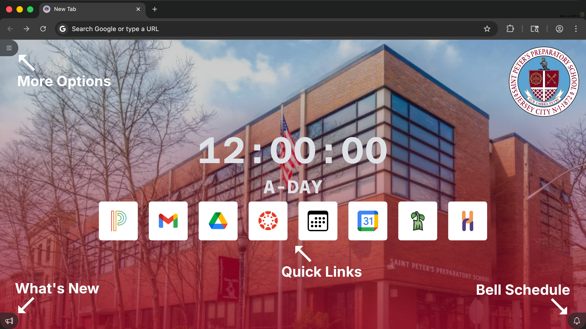
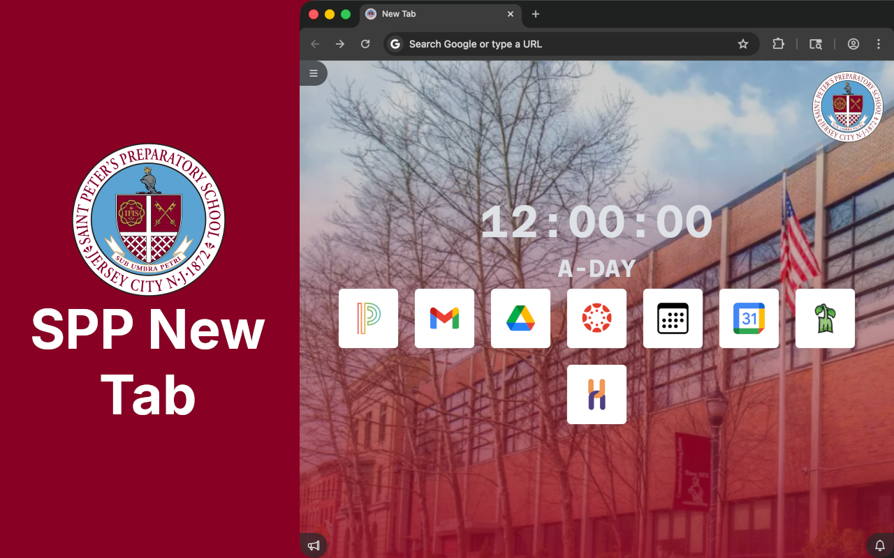
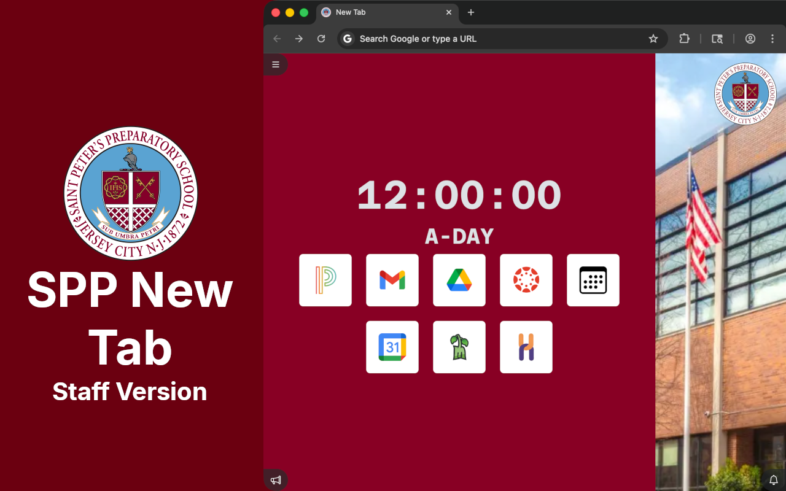
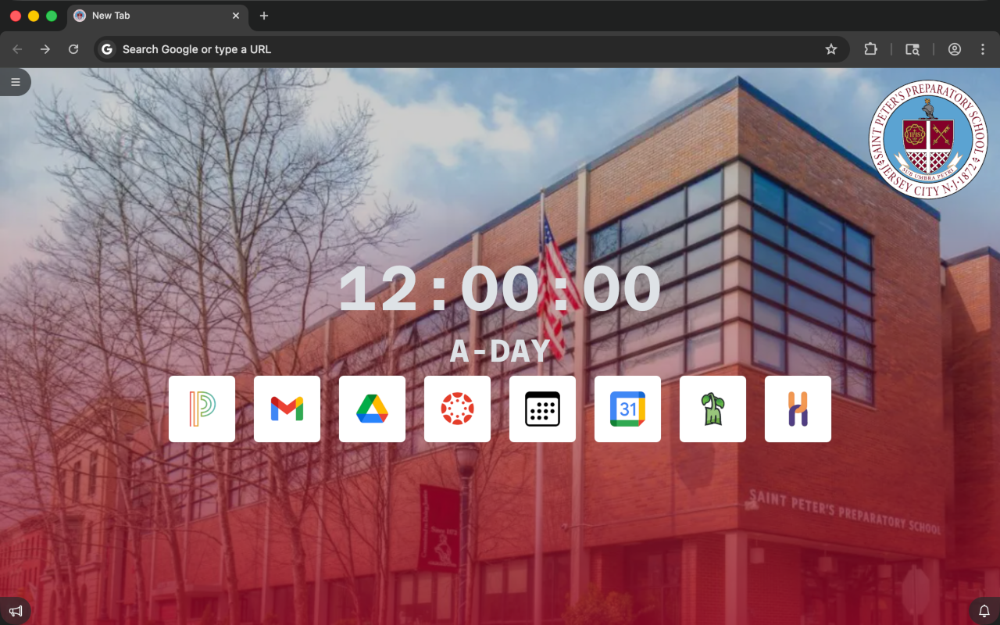
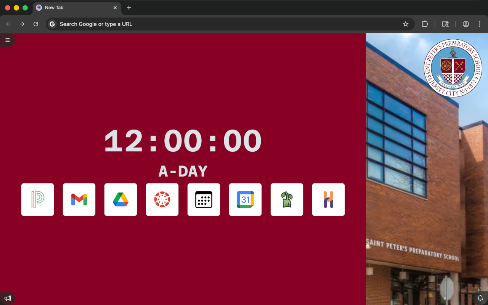
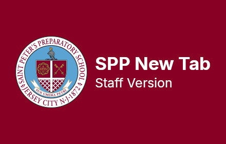

# Branding for SPP New Tab
This repo contains the images used to promote SPP New Tab. They are distributed as GIMP project (.xcf) files, and also as optimized PNG files.

# GIMP Project (.xcf) Files (inside `gimp/`)
`commons-signage.xcf`: Image used to explain what the buttons do on the New Tab. This is displayed on TVs around the campus.

`webstore-main-image.xcf`: First image displayed on the Chrome Web Store page for the student version.

`webstore-staff-main-image.xcf`: First image displayed on the Chrome Web Store page for the staff version.

`webstore-screenshot.xcf`: Second image displayed on the Chrome Web Store page for the student version.

`webstore-staff-screenshot.xcf`: Second image displayed on the Chrome Web Store page for the staff version.

`webstore-promo.xcf`: "Thumbnail" image of the extension, as displayed on the Chrome Web Store page for the student version.

`webstore-staff-promo.xcf`: "Thumbnail" image of the extension, as displayed on the Chrome Web Store page for the staff version.

# Rendered PNG Files (inside `rendered/`)
`commons-signage.png`: Image used to explain what the buttons do on the New Tab. This is displayed on TVs around the campus.

`webstore-main-image.png`: First image displayed on the Chrome Web Store page for the student version.

`webstore-staff-main-image.png`: First image displayed on the Chrome Web Store page for the staff version.

`webstore-screenshot.png`: Second image displayed on the Chrome Web Store page for the student version.

`webstore-staff-screenshot.png`: Second image displayed on the Chrome Web Store page for the staff version.

`webstore-promo.png`: "Thumbnail" image of the extension, as displayed on the Chrome Web Store page for the student version.

`webstore-staff-promo.png`: "Thumbnail" image of the extension, as displayed on the Chrome Web Store page for the staff version.

# License
CC0